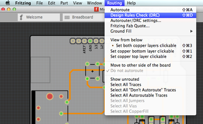
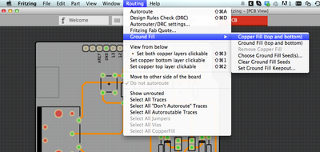

<!-- --- title: Using Fritzing with AISLER: Prepare your project for the Fab -->
# Prepare your project for the Fab #
Once your board is layed out, give it the last finishing checks before you submit it to AISLER. Already have everything covered, [[skip to the next step|use-aisler-with/Fritzing/Upload-your-project-to-AISLER]].

0. [[The Basics|use-aisler-with/Fritzing/the-basics]]
1. Prepare your project for the Fab
2. [[Uploading your project to AISLER|use-aisler-with/Fritzing/Upload-your-project-to-AISLER]]
3. [[Documenting your parts (optional)|use-aisler-with/Fritzing/Document-parts-in-AISLER]]
4. [[Holding your project in your hands|use-aisler-with/Fritzing/Holding-your-project-in-your-hands]]

### 1. Make a Design Rule Check (DRC) ###

Run **Routing > Design Rules** Check from the PCB view menu. It will alert you to problematic areas that could break your circuit, for example traces that are too close together, overlaps, too little space to the side of the board, etc.
Note that the DRC is currently very sensitive - in dense situations you can also trust your eye.

### 2. Fill up blank areas with copper (optional) ###

Use **Routing > Ground Fill > Ground Fill** from the menu to fill the blank areas of your PCB with copper and connect them to your ground signal. It makes your circuit resilient to electromagnetic interference and there will be less chemical waste produced during manufacturing.

Be careful with this step, though: If you have a "messy" sketch where there are some unrouted connections containing connections between ground and power, or if you're unsure, use a plain Copper Fill instead. This will not attempt to connect itself to ground.

**Note for Advanced Users**: We will automatically re-apply a copper fill to your PCB in the production process. If you absolutely want to keep areas of your PCB free of copper, just place a "copper fill blocker" there.

### 3. Make a paper placement test (optional) ###

Use a PDF printout of the PCB view to make a paper placement test (File > Export for Production > Etchable PDF). Check if everything is in a sensible position and if the dimensions of the footprints and your actual components match each other. You will be surprised how helpful this step is.

The next step: [Upload your project to AISLER](Upload-your-project-to-AISLER)
